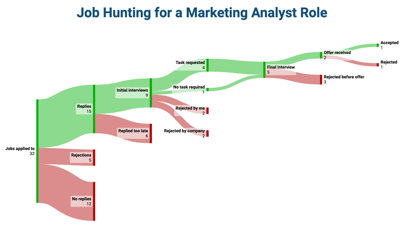

# lvl4-capstone
# AppTrack -- a software job application tracker
This is an app that will help track SW dev applications, particularly information such as stage/status, date applied/last contact, hiring manager info including email, the tech stack used in the job description, and job role/title. 

* One page allows management of the board -- create, update, delete -- based on the user. Any user can sign up, but users can only edit and delete entries they've created. This way visitors/graders can test it out without affecting any important (to the host) data. 

* The status board/log can be filtered based on stack tags, stage/status of application, user, and a global search bar where you can search for strings such as company name, hiring manager, job role/title.

* Then there is a management page accessible on login which manages adding entries, edits, status changes, and deletes. If a user is not signed in, this would show as a sign up/log in auth component. 

* The logout is handled in the navbar which appears next to the username(email) if they are logged in.
---
# Set Up steps: 
To set up this repo, python3, node.js, and npm are required. This repo uses supabase. 
You can insert your own supabase variables in a .env file within the backend folder, and the SQL to set up a table is supplied at the end of this README.
---
## Backend Setup
# Bash CLI: 
cd backend
python -m venv .venv
# On macOS/Linux:
source .venv/bin/activate
# On Windows:
source .venv\Scripts\activate
---
pip install -r requirements.txt
(This includes gunicorn required for backend deployment to Render, Flask, Flask-CORS, and Supabase)
--- 
# Start local dev server with CLI:
python app.py
* Alternatively, host the backend to render.com using Web Service, selecting Python3, and setting root directory to backend. Set start command as gunicorn app:app and insert your supabase environmental variables.
---
## Frontend Setup
Open new Bash terminal
# Bash CLI
cd frontend
npm install
# for MUI
npm install @mui/material @emotion/react @emotion/styled @mui/icons-material
# for the sankey diagram on the dashboard
npm install @nivo/core @nivo/sankey
# update the BACKEND variable line in src/context/ResourceContext.jsx
--> const BACKEND = "http://localhost:5000/api";
* Alternatively, replace "http://localhost:500" with your deployed backend render url.
# start vite development server
npm run dev
* Alternatively, deploy the frontend to a host such as Netlify using the following settings:
 - build command: npm run build
 - publish directory: dist
 - base directory: frontend

* Monorepo: https://github.com/codex-assignments/lvl4-capstone.git
* Backend: https://lvl4-capstone.onrender.com
* Frontend: 

example of type of diagram/visual on homepage/dashboard, a sankey diagram

## Wireframe of homepage:
+-----------------------------------------------------------------------------------+
|  [AppTrack]               Status Log      Manage      [ Jane@email.com ]  Logout  |  <-- Navbar
+-----------------------------------------------------------------------------------+
|                                                                                   |
|  METRIC SUMMARY CARDS                                                             |
|  +------------------+  +------------------+  +------------------+  +--------------+  |
|  | Total Applied    |  | Active Pipeline  |  | Interviews       |  | Offers       |  |
|  |     24           |  |     8            |  |     3            |  |     1        |  |
|  +------------------+  +------------------+  +------------------+  +--------------+  |
|                                                                                   |
+-----------------------------------------------------------------------------------+
|                                                                                   |
|  APPLICATION FLOW (SANKEY DIAGRAM)                                                |
|  +-----------------------------------------------------------------------------+  |
|  |                                                                             |  |
|  |                     /---> [ Screened (6) ] ----> [ Interview (3) ]          |  |
|  |  [ Applied (24) ] -                                       \                 |  |
|  |                     \---> [ No Reply (13) ]                ---> [ Offer (1)]|  |
|  |                      \--> [ Rejected (5) ]                                  |  |
|  |                                                                             |  |
|  +-----------------------------------------------------------------------------+  |
|                                                                                   |
+-----------------------------------------------------------------------------------+
|                                                                                   |
|  RECENT ACTIVITY                                            [ View Status Log -> ]|
|  +-----------------------------------------------------------------------------+  |
|  | Company         | Role                | Tech Stack       | Stage     | Date  |  |
|  |-----------------|---------------------|------------------|-----------|-------|  |
|  | Acme Corp       | Frontend Developer  | React, Vite      | Interview | Jul 28|  |
|  | Nexus Labs      | Full Stack Engineer | Python, Flask    | Applied   | Jul 25|  |
|  +-----------------------------------------------------------------------------+  |
|                                                                                   |
+-----------------------------------------------------------------------------------+

# SQL for setting up the database:

create table applications (
  id bigint generated by default as identity primary key,
  created_at timestamp with time zone default timezone('utc'::text, now()) not null,
  company_name text not null,
  job_title text not null,
  job_url text,
  location text,
  salary_range text,
  hiring_manager_name text,
  hiring_manager_email text,
  tech_stack text[],
  stage text not null default 'Applied',
  date_applied date default current_date,
  last_contact_date date,
  resume_version_used text,
  job_description text,
  notes text,
  user_id uuid references auth.users(id) default auth.uid()
);

alter table applications enable row level security;

create policy "Allow public read access" on applications for select using (true);
create policy "Allow authenticated insert own application" on applications for insert with check (auth.uid() = user_id);
create policy "Allow authenticated update own application" on applications for update using (auth.uid() = user_id);
create policy "Allow authenticated delete own application" on applications for delete using (auth.uid() = user_id);